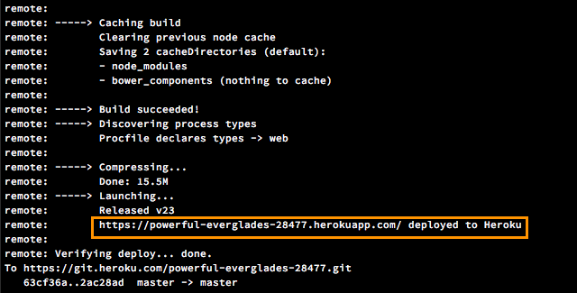

# Facebook Chatbot, using api.ai and Node.js framework


<p></p>


<p></p>

#
# Demo:


#
# Instruction
## node.js
Initiate node.js, and install express, request, body-parser
```sh
$ npm init
$ npm install express request body-parser --save
```
## Install heroku and push to heroku
```sh
brew install heroku # isntall heroku
git init
heroku --version
heroku login
heroku create
git push heroku master
```
Then you will find this link as marked below:

This link will be the default link of our reponse. For example, if we set our Route as:
```sh
// ROUTES
app.get('/', function(req, res) {
	res.send("Hi I am a chatbot")
})
```
Then if you copy that link and paste into your browser, you will see "Hi I am a chatbot"
To debug the code, we can type:
```sh
heroku logs
```
Also, we can push to github at the same time:
```sh
# push to github
git init
echo "# chatbot" >> README.md
git add README.md
git commit -m "add to github"
git remote set-url origin https://github.com/helq2612/chatbot.git
git push origin master
```

## api.ai

# useful links:
http://www.girliemac.com/blog/2017/01/06/facebook-apiai-bot-nodejs/
https://www.youtube.com/watch?v=bUwiKFTvmDQ&t=1046s
https://www.youtube.com/watch?v=P1on3cnpieo&t=361s
